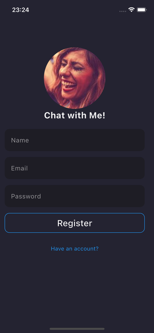
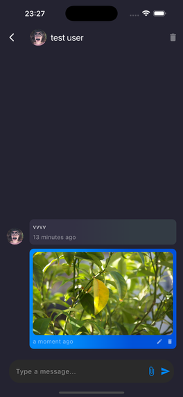

# Chat With Me 📱💬

[](https://flutter.dev)
[](https://firebase.google.com)
[](LICENSE)

Мобильное чат-приложение на Flutter с поддержкой личных и групповых чатов, отправкой текстовых сообщений и изображений.

---

## 📸 Скриншоты




 


*(Добавьте реальные скриншоты в папку `screenshots/`)*

---

## ✨ Функциональность

### 📱 Основные возможности
- ✅ **Авторизация и регистрация** через электронную почту
- ✅ **Личные чаты** между двумя пользователями
- ✅ **Групповые чаты** с неограниченным количеством участников
- ✅ **Отправка текстовых сообщений** в реальном времени
- ✅ **Отправка изображений** с возможностью предпросмотра
- ✅ **Поиск пользователей** по имени
- ✅ **Индикатор активности** (последний раз в сети)
- ✅ **Удаление чатов** с полной очисткой сообщений и файлов
- ✅ **Автоматическая разфокусировка** полей ввода при клике вне них

### 🔒 Безопасность
- Все данные хранятся в защищённой базе данных Firebase Firestore
- Файлы изображений загружаются в защищённое хранилище Firebase Storage
- Авторизация через проверенный механизм Firebase Auth

---

## 🛠 Технологии и стек

### Фронтенд
- **Flutter** 3.0+ — кроссплатформенный фреймворк
- **Dart** — язык программирования

### Бэкенд и инфраструктура
- **Firebase Firestore** — NoSQL база данных для хранения чатов, сообщений и пользователей
- **Firebase Authentication** — система авторизации
- **Firebase Storage** — хранилище для изображений
- **Firebase Analytics** — аналитика использования (только в debug-режиме)

### Архитектура и паттерны
- **Provider** — управление состоянием приложения
- **GetIt** — dependency injection (DI)
- **ChangeNotifier** — реактивное обновление UI
- **Service Layer** — разделение бизнес-логики и представления
- **Clean Architecture** — модульная структура кода

### Сторонние пакеты
```yaml
dependencies:
  flutter:
    sdk: flutter
  provider: ^6.0.0        # State management
  get_it: ^7.0.0          # Dependency injection
  cloud_firestore: ^4.0.0 # Firebase Firestore
  firebase_auth: ^4.0.0   # Firebase Authentication
  firebase_storage: ^11.0.0 # Firebase Storage
  firebase_core: ^2.0.0   # Firebase Core
  firebase_analytics: ^10.0.0 # Firebase Analytics
  flutter_keyboard_visibility: ^6.0.0 # Отслеживание клавиатуры
  path: ^1.9.1 
```


### Доработать:
- Создаётся дубликат чата с тем же собеседником
- Отсутствует состояние loading и error в UI
- Какая-то ошибка о недостающих данных в консоли (в прослушке)
- Рефакторинг -> clean architecture + bloc + multimodules
- Добавление нотификаций
- Выкласть в TestFlight